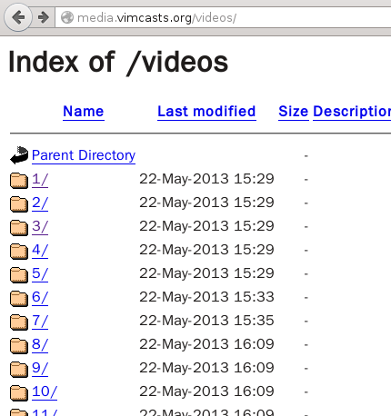
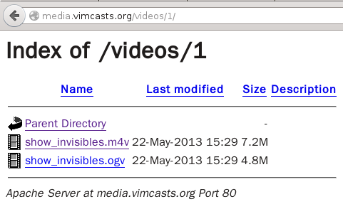

# python version 2.7.10

# batch_down
batch download pictures form a url with python

Usage:
	假设需要批量下载的图片URL如下所示:  
	http://example_target_url/01.jp  
	http://example_target_url/02.jpg  
	...  
	http://example_target_url/50.jpg  
	批量下载这50张图片:  

	保存图片在当前目录  
	python batch_down.py 1 50 http://example_target_url/  
	保存图片在指定目录  
	python batch_down.py 1 50 http://example_target_url/ /home/pic  

添加另外一种下载方法,从文件中读取出下载地址,依次下载  
python download_from_list.py list.xml 会从指定的文件中读取下载的URL  

Python爬虫利器二之Beautiful Soup的用法:  
参考:http://cuiqingcai.com/1319.html  
Beautiful Soup 安装,需要root权限  
sudo emerge -v dev-python/pip  
sudo pip install beautifulsoup4  

使用方法:  
python grab_webpage.py http://www.python.org

# video batch download (批量下载视频)

比如需要把http://media.vimcasts.org/videos/网站上所有.m4v格式的视频都下载下来

python video_batch_download.py
